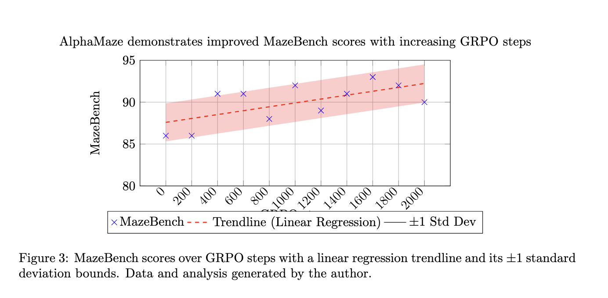

<div align="center">

# AlphaMaze: Teaching LLMs to Think Visually
<!---
<a href='https://homebrew.ltd/blog/alpha-maze'></a>
<a href='https://huggingface.co/homebrewltd/AlphaMaze-v0.2-1.5B'></a>
<a href='https://huggingface.co/datasets/homebrewltd/Maze-Reasoning-v0.1'></a>
<a href='https://alphamaze.menlo.ai/'></a>
<a href='https://arxiv.org/abs/2502.14669'></a>
-->

[**About**](#About) | [**Demo**](#Demo) | [**Models and Datasets**](#Models-and-Dataset) | [**Benchmarks**](#Benchmarks) | [**How to Run Locally**](#Run-Locally) | 


</div>

## About
Welcome to **AlphaMaze**, a novel approach to enhance visual reasoning in large language models (LLMs).  Forget complex image processing – AlphaMaze challenges models with a deceptively simple task: solving mazes presented *entirely* in text. AlphaMaze isn't just about finding the exit; it's about understanding the maze's structure and strategically deciding when to reset after encountering a dead end.

Prior research, like [Microsoft's "Multimodal Visualization-of-Thought (MVoT)"](https://arxiv.org/abs/2501.07542), explored visual reasoning through image generation.  But AlphaMaze takes a different, more focused path.  We believe that if a model can internally reconstruct a maze from a text description and use that *mental map* to plan its moves, it demonstrates a genuine capacity for visual reasoning – even without generating a single image.  AlphaMaze moves beyond the limitations of multiple-choice evaluations, providing a richer, more nuanced assessment of a model's spatial understanding.  We're not just testing if a model *can* solve a maze; we're revealing *how* it thinks about space.

## Demo

AlphaMaze tackle a text-based maze! See how it interprets the maze, plans its moves, and strategically resets when it encounters a dead end.

[](https://www.youtube.com/watch?v=dUS9wR03on8)

Alternatively, you can explore it on our [demo website](https://alphamaze.menlo.ai/).

## Models and Datasets

### Models

You can find our AlphaMaze models on Hugging Face 🤗! We're committed to open-source and easy access for the research community.

| Model        | Backbone                                                                 | Size  | Link                                                                      |
|--------------|--------------------------------------------------------------------------|-------|----------------------------------------------------------------------------|
| AlphaMaze-v0.1 | [DeepSeek-R1-Distill-Qwen-1.5B](https://huggingface.co/deepseek-ai/DeepSeek-R1-Distill-Qwen-1.5B) | 1.5B  | [🤗 AlphaMaze-v0.1](https://huggingface.co/homebrewltd/AlphaMaze-v0.2-1.5B) |

### Datasets

We've released our datasets on Hugging Face 🤗 to support reproducibility and further research.

| Dataset                             | Description                                         | Size  | Link                                                                                    |
|--------------------------------------|-----------------------------------------------------|-------|-----------------------------------------------------------------------------------------|
| Maze-Reasoning-v0.1                  | Training set used for Supervised Fine-Tuning (SFT) | 420k  | [🤗 Maze-Reasoning-v0.1](https://huggingface.co/datasets/homebrewltd/Maze-Reasoning-v0.1) |
| Maze-Reasoning-Reset-v0.1          | Training set for SFT, including reset actions        | 50k   | [🤗 Maze-Reasoning-Reset-v0.1](https://huggingface.co/datasets/homebrewltd/Maze-Reasoning-Reset-v0.1) |
| Maze-Reasoning-GRPO-v0.1             | Training set used for GRPO model                    | 180k  | [🤗 Maze-Reasoning-GRPO-v0.1](https://huggingface.co/datasets/homebrewltd/Maze-Reasoning-GRPO-v0.1) |

## Benchmarks

### Supervised Fine-Tuning (SFT)

We used [LLaMA-Factory](https://github.com/hiyouga/LLaMA-Factory) for Supervised Fine-Tuning (SFT) of our AlphaMaze model.  Here's a summary of our key training runs:

| Run ID | Model Config                                                                             | Dataset                                                                  | Steps | Final Loss | Hardware                | Key Findings                                                                                                                                                               |
|--------|-------------------------------------------------------------------------------------------|--------------------------------------------------------------------------|-------|------------|-------------------------|------------------------------------------------------------------------------------------------------------------------------------------------------------------------|
| exp-1  | [Full Finetune (Qwen-1.5B)](https://github.com/janhq/visual-thinker/blob/main/training/Llama-factory-config/Qwen2.5_1.5B_distil.yaml) | [Maze Reasoning](https://huggingface.co/datasets/jan-hq/Maze-Reasoning) | 3125  | 0.01       | ~1.5 hours on 6xA6000  | Initial run with new maze tokens.  Observed lower performance.                                                                                                      |
| exp-2  | [Full Finetune (Qwen-1.5B)](https://github.com/janhq/visual-thinker/blob/main/training/Llama-factory-config/Qwen2.5_1.5B_distil.yaml) | [Maze Reasoning](https://huggingface.co/datasets/jan-hq/Maze-Reasoning) | 3125  | 0.01       | ~1.5 hours on 6xA6000  | Trained using pure text descriptions (no new tokens).  Surprisingly strong performance.                                                                        |
| exp-3  | [Full Finetune (Qwen-7B)](https://github.com/janhq/visual-thinker/blob/main/training/Llama-factory-config/Qwen2.5_7B_distil.yaml)   | [Maze Reasoning](https://huggingface.co/datasets/jan-hq/Maze-Reasoning) | 2344  | 0.0077     | ~12 hours on 6xA6000 | Extended training with pure text descriptions (larger model).                                                                                            |
| exp-4  | [Full Finetune (Qwen-1.5B)](https://github.com/janhq/visual-thinker/blob/main/training/Llama-factory-config/Qwen2.5_1.5B_distil.yaml) | [Maze Reasoning](https://huggingface.co/datasets/jan-hq/Maze-Reasoning) | 2344  | ~0         | ~1.5 hours on 6xA6000  | Further extended training with pure text descriptions.  Near-zero loss.                                                                                           |
| exp-5  | [Full Finetune (Qwen-1.5B)](https://github.com/janhq/visual-thinker/blob/main/training/Llama-factory-config/Qwen2.5_1.5B_distil.yaml) | [Maze Reasoning](https://huggingface.co/datasets/jan-hq/Maze-Reasoning) | 3681  | ~0.02      | ~1 hours on 8xH200   | Experiment with new maze tokens and different hardware.                                                                                                   |

**Key Observations from SFT:**

*   Adding new maze-specific tokens did *not* improve performance, and in some cases, resulted in worse results.
*   Surprisingly, the model performed well even with *pure text descriptions*, suggesting a strong ability to learn spatial relationships from text alone.
*	Loss value equal to 0 is concerning.

**Note:** These results suggest that reducing token complexity can lead to improved performance in translating spatial information into language.

### Group Relative Policy Optimization (GRPO)

We employed [Unsloth](https://unsloth.ai/) for Group Relative Policy Optimization (GRPO) to further refine the model's maze-solving policy.

The plot below shows the MazeBench scores (blue crosses) achieved during GRPO training, along with a linear regression trendline (red dashed line).  The upward trend demonstrates that GRPO effectively guides the model towards improved maze-solving strategies.


_GRPO training progress, showing MazeBench scores over training steps._


## Run Locally

For an example of using AlphaMaze with HuggingFace Transformers:

```python
import torch
from transformers import AutoTokenizer, AutoModelForCausalLM
import flash_attn

model_path =  "homebrewltd/AlphaMaze-v0.2-1.5B"

tokenizer = AutoTokenizer.from_pretrained(model_path)

model = AutoModelForCausalLM.from_pretrained(
    model_path,
    torch_dtype=torch.float16,
    device_map="auto",
    attn_implementation="flash_attention_2",
)

maze =  """You are a helpful assistant that solves mazes. You will be given a maze represented by a series of tokens. The tokens represent: - Coordinates: <|row-col|> (e.g., <|0-0|>, <|2-4|>) - Walls: <|no_wall|>, <|up_wall|>, <|down_wall|>, <|left_wall|>, <|right_wall|>, <|up_down_wall|>, etc. - Origin: <|origin|> - Target: <|target|> - Movement: <|up|>, <|down|>, <|left|>, <|right|>, <|blank|> Your task is to output the sequence of movements (<|up|>, <|down|>, <|left|>, <|right|>) required to navigate from the origin to the target, based on the provided maze representation. Think step by step. At each step, predict only the next movement token. Output only the move tokens, separated by spaces. MAZE: <|0-0|><|up_left_wall|><|blank|><|0-1|><|up_down_wall|><|blank|><|0-2|><|up_down_wall|><|blank|><|0-3|><|up_right_wall|><|blank|><|0-4|><|up_left_right_wall|><|blank|> <|1-0|><|down_left_wall|><|blank|><|1-1|><|up_right_wall|><|blank|><|1-2|><|up_left_wall|><|blank|><|1-3|><|down_right_wall|><|blank|><|1-4|><|left_right_wall|><|blank|> <|2-0|><|up_left_wall|><|blank|><|2-1|><|down_right_wall|><|blank|><|2-2|><|down_left_wall|><|blank|><|2-3|><|up_down_wall|><|blank|><|2-4|><|down_right_wall|><|target|> <|3-0|><|left_right_wall|><|blank|><|3-1|><|up_left_wall|><|origin|><|3-2|><|up_right_wall|><|blank|><|3-3|><|up_down_left_wall|><|blank|><|3-4|><|up_right_wall|><|blank|> <|4-0|><|down_left_wall|><|blank|><|4-1|><|down_right_wall|><|blank|><|4-2|><|down_left_wall|><|blank|><|4-3|><|up_down_wall|><|blank|><|4-4|><|down_right_wall|><|blank|>"""

messages = [
    {
        "role": "user",
        "content": maze
    }
]

input_ids = tokenizer.apply_chat_template(messages, tokenize=True, add_generation_prompt=True, return_tensors='pt').to("cuda")
generated_ids = model.generate(input_ids, max_new_tokens=2500, temperature=0.8, repetition_penalty=1.1, do_sample=True, eos_token_id=tokenizer.eos_token_id)
response = tokenizer.decode(generated_ids[0], skip_special_tokens=True, clean_up_tokenization_space=True)
print(f"Solving maze: {response}")
```

## Next Steps
We are exploring further GRPO enhancements to boost maze-solving capabilities. Stay tuned for more updates on how GRPO is paving the way for improved spatial reasoning in LLMs!

## Join Us

We're looking for collaborators and plan to expand the model's capabilities to include additional spatial tasks in the future.

## References

```bibtex
```

## Acknowledgement

- [llama-factory](https://github.com/hiyouga/LLaMA-Factory)
- [unsloth](https://unsloth.ai/)
- [Deepseek](https://github.com/deepseek-ai/DeepSeek-R1)
- [Multimodal Visualization-of-Thought (MVoT)](https://arxiv.org/abs/2501.07542)
